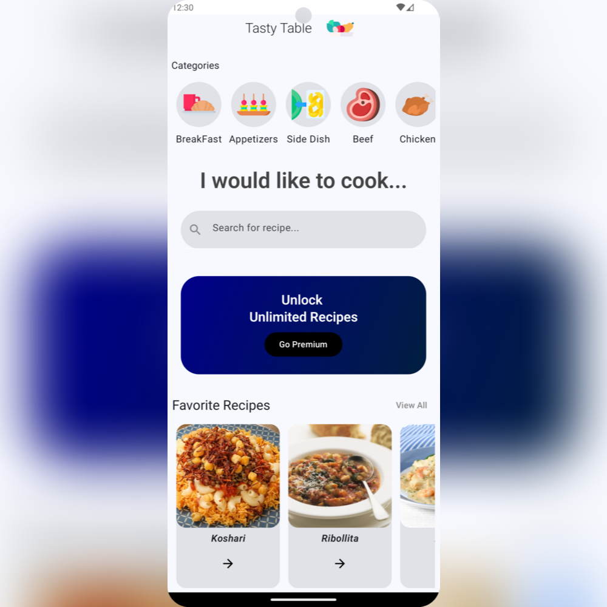
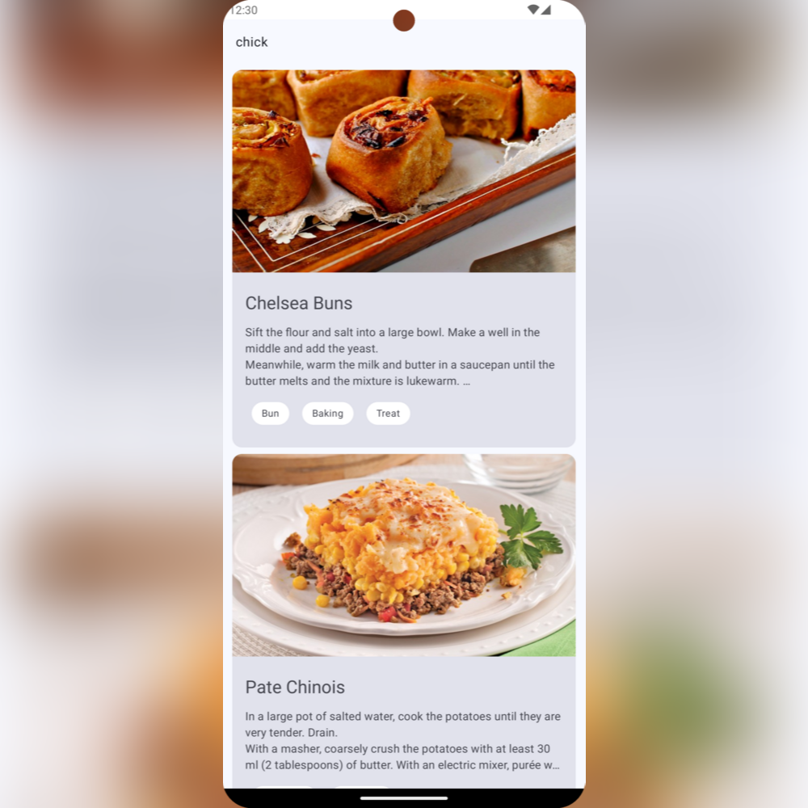
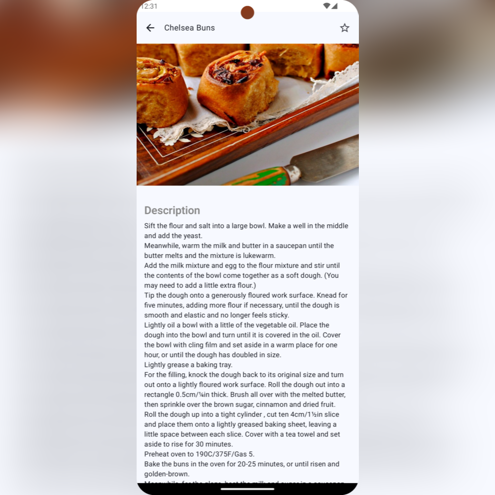
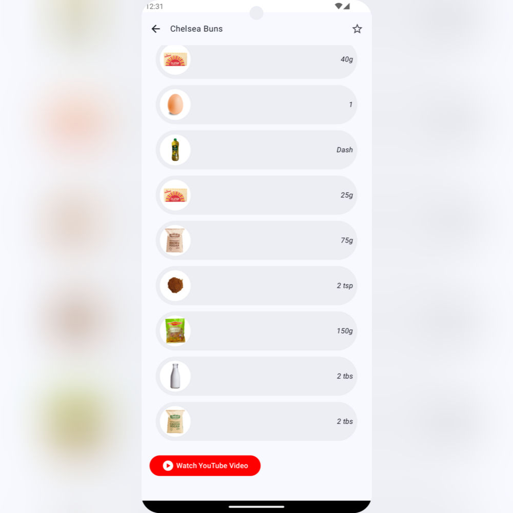
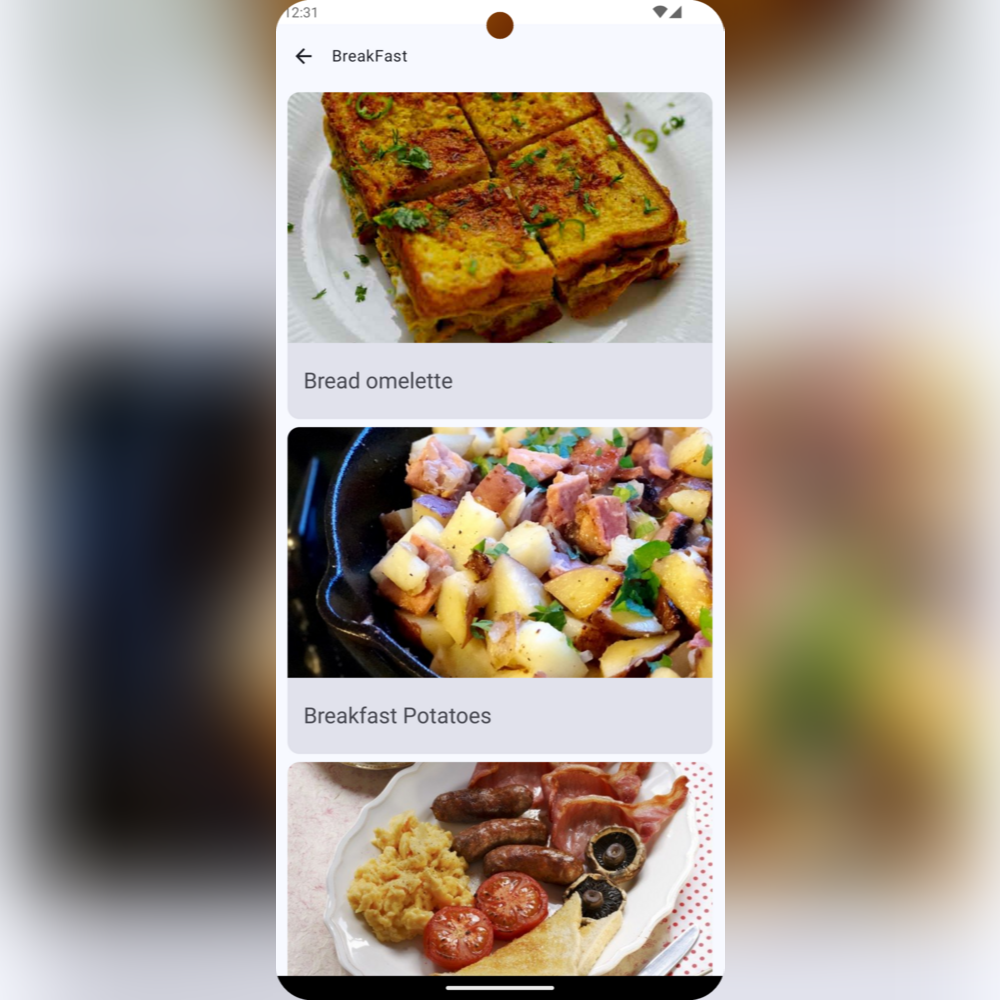

# Tasty-Table

Tasty Table is an app created to help you discover and explore recipes using Jetpack Compose.

## Result

### UI
|  |  |  |  | | 

|----------|:----------:|:--------:|:---------:|:---------:|

## Technologies Used

Tasty Table utilizes a combination of modern technologies to create a seamless and responsive recipe discovery experience. Below are the key technologies and libraries implemented:

- **[Kotlin](https://kotlinlang.org/)**: The primary programming language for developing the app, known for its concise syntax and powerful features for Android development.
- **[Jetpack Compose](https://developer.android.com/jetpack/compose)**: A modern Android UI toolkit used to build native UI components with a declarative approach, enabling fast and efficient UI creation.
- **[Ktor](https://ktor.io)**: A type-safe HTTP client used for API integration, enabling the app to fetch recipe data from external sources efficiently.
- **[Room](https://developer.android.com/training/data-storage/room)**: An SQLite object mapping library for local database management, providing offline access to saved recipes.
- **[MVI (Model-View-Intent)](https://developer.android.com/topic/architecture)**:The architectural pattern adopted to manage the flow of data and state within the app in a predictable manner.
- **[Koin](https://insert-koin.io/)**: A lightweight dependency injection library for Kotlin, simplifying the app's dependency management.
- **[Mockk](https://mockk.io/)**: A mocking library used for writing unit tests, ensuring the app's functionality is reliable and well-tested.

## Features

- **Search Recipes by Name**: Easily find recipes by entering their name in the search bar.
- **Find Recipes by Category**: Browse through different recipe categories to discover meals of interest.
- **View Recipe Details**: Access detailed instructions and ingredients for each recipe.
- **Watch YouTube Recipe Videos**: Watch cooking tutorials and demonstrations directly via YouTube links.
- **Add to Favorites**: Save your favorite recipes to access them quickly later.
- **Delete from Favorites**: Remove recipes from your favorites list when they’re no longer needed.

## Installation

To use the Tasty-Table app,
you can download it from the following link: 
[Tasty-Table apk](https://www.mediafire.com/file/j3ddpzxxdvcof33/tasty-table.apk/file)

## Upcoming Implementations

- **Premium Subscription**: Introduce a premium subscription model to allow users to access unlimited recipes.
- **Last Watched Recipes**: Implement a feature to view the last watched recipes for quick access.
